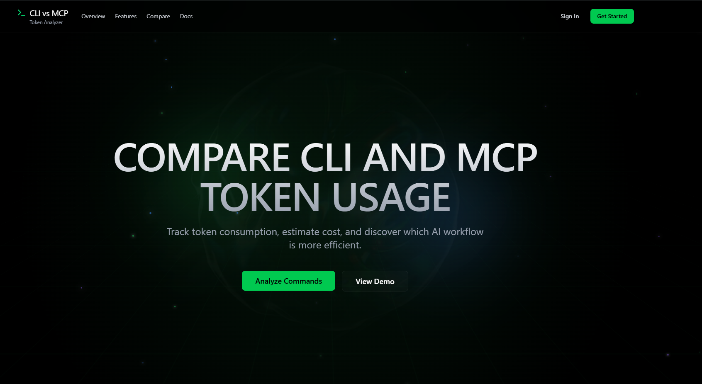

# MCP vs CLI Token Analyzer

Calculate and compare token usage and cost between CLI and MCP command workflows.

## Project Structure

- `backend/` Express + TypeScript API for comparisons, reports, settings, exports, CLI execution, and MCP integration
- `frontend/` Vite + React dashboard for analysis, history, and settings

## Run locally

1. Start the backend
   `cd backend`
   `npm install`
   `npm run dev`
2. Start the frontend in a second terminal
   `cd frontend`
   `npm install`
   `npm run dev`

The frontend uses `http://localhost:5000/api` by default.
